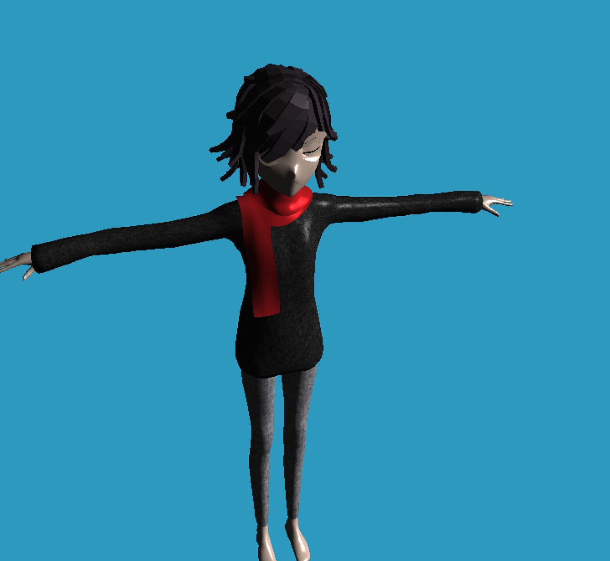

# Using the program:
You will need PyGame and modernGL installed to successfully run this python program. Use `python3 main.py`
You Will be entering a 3D space, controlling the camera with your mouse and move in space with WASD, shift and space.
A 3d object is included (by reading from an .obj file), the actual texture and special feature in the model is not fully supported since it's not built for this program specifically.

